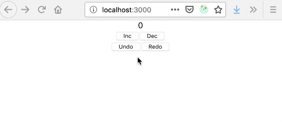

# storeon-undo


Tiny module for [Storeon] to add `undo` and `redo` functionality.

It is just 196 bytes module (it uses [Size Limit] to control the size) without any dependencies.

[Size Limit]: https://github.com/ai/size-limit
[Storeon]: https://github.com/storeon/storeon

## Installation

```
npm install @storeon/undo
```

## Usage

To using the undo/redo functionality you just need to add the `undoable` module to `createStore`.

```js
import createStore from 'storeon'
import undoable from '@storeon/undo'

let counter = store => {
  store.on('@init', () => ({ counter: 0, counter2: 0 }))

  store.on('inc', (state) => ({ counter: state.counter + 1}))
  store.on('dec', (state) => ({ counter: state.counter - 1}))
}

const store = createStore([
  counter,
  undoable
 ])
```

And now you can use the functions `undo` and `redo` to manipulate the history.

```js
const Counter = () => {
  const { dispatch, counter } = useStoreon('counter')
  return <React.Fragment>
    <div>{counter}</div>
    <button onClick={() => dispatch('inc')}>Inc</button>
    <button onClick={() => dispatch('dec')}>Dec</button>
  </React.Fragment>
}

const UndoRedo = () => {
  const { dispatch } = useStoreon('undoable')

  return <React.Fragment>
    <button onClick={() => dispatch('undo')}>Undo</button>
    <button onClick={() => dispatch('redo')}>Redo</button>

  </React.Fragment>
}
```



## LICENSE

MIT

## Acknowledgments

This module based on [Implementing Undo History recipe](https://redux.js.org/recipes/implementing-undo-history) article.

